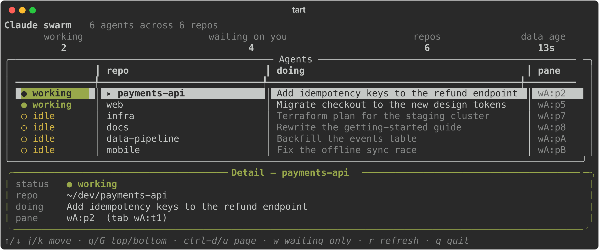

# tart

Live terminal artifacts: dashboards that stay open, keep their own data
fresh, and can be found again by name.



```bash
uv tool install tartifacts   # the command is `tart`
```

## An artifact is three files

```
spend.json     manifest: what runs it, what produces its data, when that data expires
fetch.py       writes JSON to tartifacts.data_path()
show.py        render(state, console) returns any rich renderable
```

```json
{
  "title": "Cloud spend",
  "run":   "uv run --with rich --with tartifacts python show.py",
  "data":  "data/spend.json",
  "fetch": "uv run --with tartifacts python fetch.py",
  "stale_after": "4h",
  "auto_refresh": true
}
```

```python
from tartifacts import app, widgets

def render(state, console):
    return widgets.stack(
        widgets.header(f"{len(state['data']['rows'])} rows"),
        widgets.trend(state["data"]["daily"], style="green"),
    )

app.run(render=render)
```

`render()` can return any rich renderable. `tartifacts.widgets` adds the
few things rich lacks for a live dashboard: a scrolling cursor, sparklines,
height budgeting, key bindings. Use them or don't.

## Quick start

```bash
tart register path/to/spend.json
tart run spend                      # from any directory
```

Registering a manifest trusts it. One that tart finds by scanning needs
`tart trust <name>` first, and editing either asks again.

## CLI

```bash
tart list                    # what's declared, what's live
tart run <name>              # launch, fetching first if stale
tart render <name> [--json]  # one frame headless, or the numbers as JSON
tart fetch <name>            # re-run its data command
tart logs <name>             # the last fetch's outcome and output, even from cron
tart cron <name>             # a crontab line that keeps it fresh, PATH included
tart register <path>         # adopt a manifest from anywhere
tart trust <name>            # approve a scanned manifest
tart roots add <path>        # a workspace to scan
tart --skill                 # full reference, written for agents
```

## Examples

Eight working artifacts in [`examples/`](examples/): local Claude Code
agents, ad spend, newsletters, open issues, battery, Wi-Fi, cron, disk.
Copy one, change the fetch.
