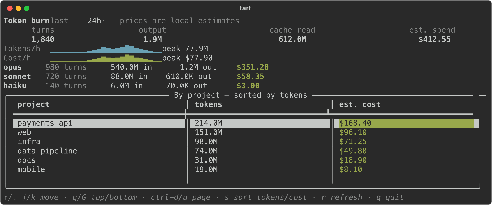
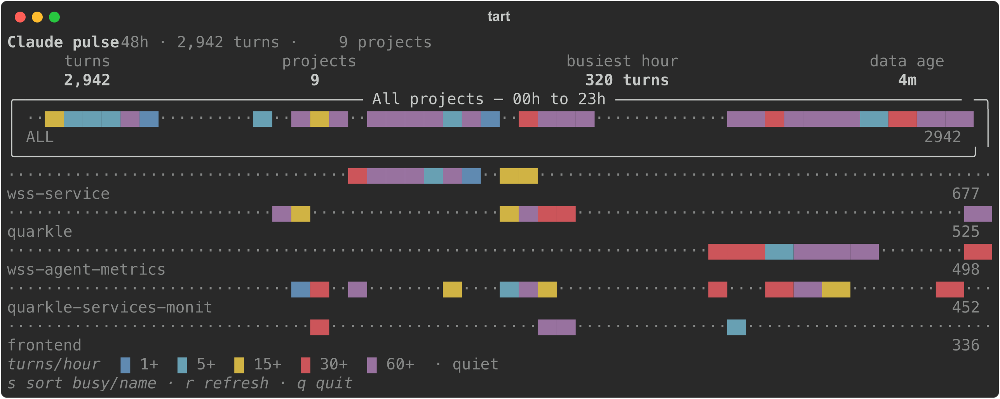
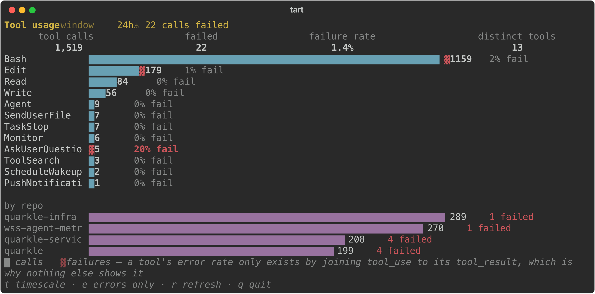
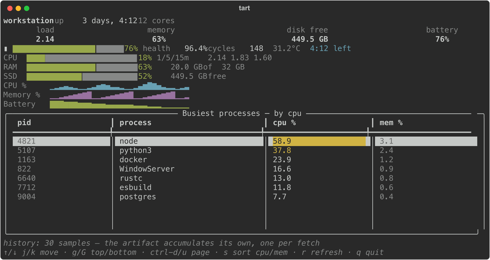
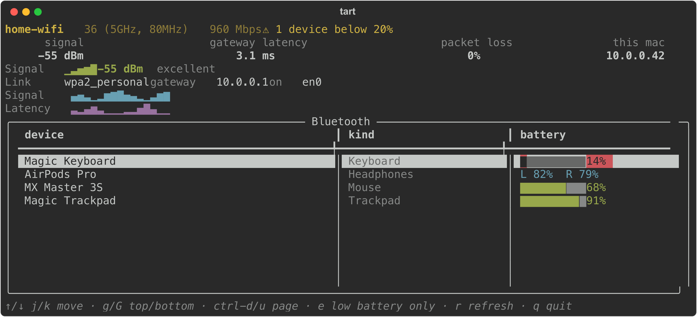
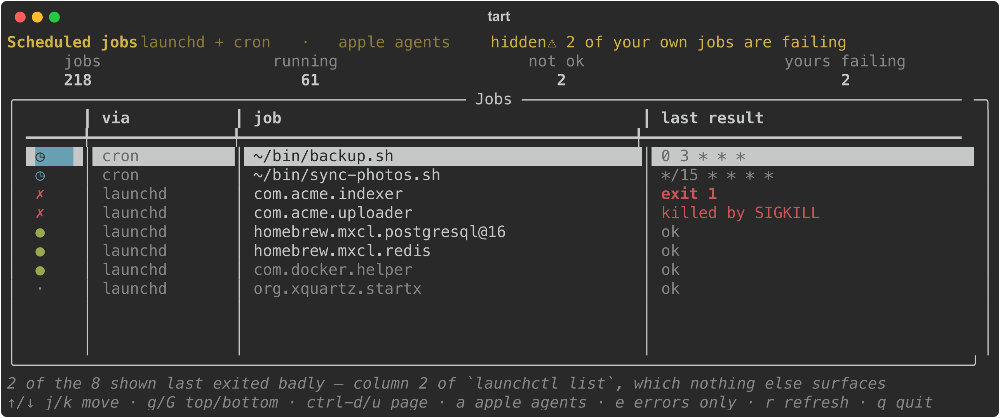
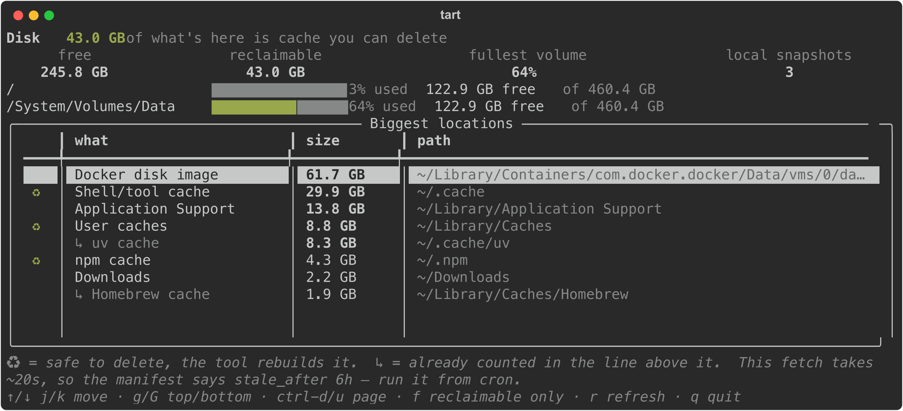

# Examples — live terminal artifacts for watching Claude

Four artifacts that visualise the Claude Code agents on this machine.
Copy one, change the fetch, keep the shape.

| artifact | shows | data source | pattern it demonstrates |
|---|---|---|---|
| `claude-swarm` | every agent, what it's doing, who's blocked | `herdr agent list` | table + cursor + detail panel, `auto_refresh` |
| `claude-burn` | 24h of tokens and dollars by model/project | `~/.claude/projects/*.jsonl` | sparkline trends + KPIs |
| `claude-pulse` | 48h activity heatmap, one strip per project | `~/.claude/projects/*.jsonl` | `timeline` strips |
| `claude-tools` | which tools agents reach for, and which **fail** | `~/.claude/projects/*.jsonl` | a bar chart — no table at all |

## Your machine

| artifact | shows | cost | pattern it demonstrates |
|---|---|---|---|
| `mac-vitals` | battery health, load, memory, disk + trends | instant | **self-accumulating history** — sparklines from repeated fetches, no database |
| `mac-airwaves` | Wi-Fi signal, latency, Bluetooth batteries | ~5s | expensive fetch behind `stale_after` |
| `mac-schedule` | launchd + cron, and what last **failed** | instant | a togglable filter (`a`) over one dataset |
| `mac-space` | biggest folders + what's safe to delete | ~20s | slow fetch, `stale_after: 6h`, run from cron |

`mac-schedule` reads column 2 of `launchctl list` — the last exit status of a
job that already ran and vanished. Nothing else on macOS surfaces it, so
background jobs fail silently for months.

`mac-space` marks reclaimable caches with ♻ and excludes nested paths from
the headline (`~/.cache/uv` lives inside `~/.cache`, and summing both counts
those bytes twice).

```bash
tart trust claude-swarm && tart run claude-swarm
```

Two notes on the fetch scripts. They **tail-scan** the transcripts — the
full set is gigabytes and a fetch nobody waits for is a fetch nobody runs;
the last few MB of each recently-touched file is where today lives. And the
prices in `burn_fetch.py` are **local estimates you should edit**, not a bill.

Every artifact binds its keys with `widgets.Keys`, so one definition drives
both dispatch and the footer:

| artifact | keys |
|---|---|
| `claude-swarm` | `w` waiting-on-you only |
| `claude-burn` | `s` sort by tokens / cost |
| `claude-pulse` | `s` sort by busiest / name |
| `claude-tools` | `t` 24h ↔ 7d · `e` errors only |
| `mac-vitals` | `s` sort processes by cpu / mem |
| `mac-airwaves` | `e` low-battery devices only |
| `mac-schedule` | `a` Apple agents · `e` errors only |
| `mac-space` | `f` reclaimable only |

Whatever a key toggles is a plain value in `state`, so every one of those
views is reachable headlessly — `tart render mac-schedule --state '{"errors_only": true}'`
renders exactly what pressing `e` shows.

## What they look like

### `claude-swarm`
every agent, what it's doing, who's blocked


### `claude-burn`
24h of tokens and dollars by model and project



### `claude-pulse`
48h activity heatmap, one strip per project



### `claude-tools`
which tools agents reach for, and which fail



### `mac-vitals`
battery health, load, memory, disk, busiest processes



### `mac-airwaves`
Wi-Fi signal, latency, every Bluetooth battery



### `mac-schedule`
launchd + cron, and what last failed



### `mac-space`
biggest folders and what's safe to delete



Regenerate with `./examples/screenshots.sh` — `tart render --svg` exports the
frame exactly as it renders, so the images can't drift from the code. Five of
the eight are shot against the sample payloads in `demo/` so they show no
personal state; the rest render real local data that identifies nobody.
